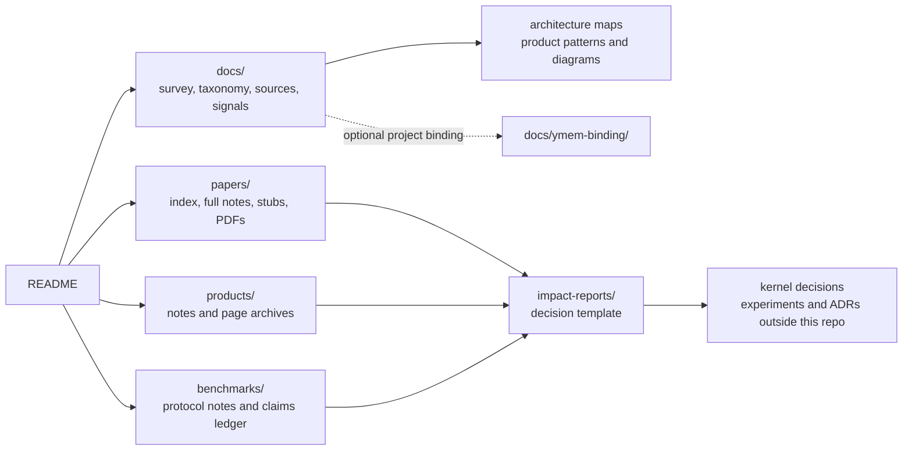

<div align="center">

# awesome-agent-memory

**Decision-grade evidence base for long-term memory in LLM agents: scraped-paper index, current-source radar, product notes, benchmark protocols, architecture maps, and a research-to-ADR workflow.**

[中文](README_cn.md) · **English**

[](LICENSE)
[](papers/index.md)
[](papers/pdfs/)
[](products/)
[](benchmarks/)
[](docs/meta-surveys.md)
[](docs/signals.md)

</div>

---

## Table Of Contents

1. [What This Repository Is](#what-this-repository-is)
2. [At A Glance](#at-a-glance)
3. [How To Use It](#how-to-use-it)
4. [Evidence Model](#evidence-model)
5. [Repository Map](#repository-map)
6. [Repository Layout](#repository-layout)
7. [Scope Boundaries](#scope-boundaries)
8. [License And Archival Policy](#license-and-archival-policy)
9. [Origin And Maintenance](#origin-and-maintenance)
10. [Contributing](#contributing)

## What This Repository Is

`awesome-agent-memory` is not only an awesome list. It is a structured evidence
base for deciding how long-term memory should be designed, evaluated, and
operated in LLM agent systems.

The repository separates five evidence layers:

| Layer | What it owns | Main entry point |
|---|---|---|
| Papers | Scholarly claims, methods, and local reading notes | [`papers/index.md`](papers/index.md) |
| Products | Public behavior of memory products and memory-enabled platforms | [`docs/products-landscape.md`](docs/products-landscape.md) |
| Benchmarks | Evaluation protocols, usage events, vendor claims, and critique records | [`docs/benchmarks-landscape.md`](docs/benchmarks-landscape.md) |
| Synthesis | Taxonomy, living survey, architecture patterns, source maps, and signal logs | [`docs/README.md`](docs/README.md) |
| Decision workflow | How evidence becomes ImpactReports, experiments, and ADR inputs | [`docs/research-radar.md`](docs/research-radar.md) |

The core maintenance rule is simple: keep direct evidence, maintainer inference,
vendor self-claims, affiliated evaluations, and independent reproductions in
separate buckets.

## At A Glance

| Area | Current coverage | Entry point | Use it when you need to |
|---|---:|---|---|
| Paper index | 989 scraped papers + manual radar additions through 2026-08 | [`papers/index.md`](papers/index.md) | Searchable entry point for agent-memory papers; the 989 count is the 2026-05 scrape baseline. |
| Paper stubs | 988 stubs | [`papers/stubs/`](papers/stubs/) | Track papers that are covered but not yet fully read. |
| Local PDFs | 534 files | [`papers/pdfs/`](papers/pdfs/) | Re-read sources and audit paper notes. |
| Full / seed paper notes | 7 full + 24 seed | [`papers/`](papers/) | Use human-read notes for architectural decisions. |
| Memory product notes | 38 notes | [`products/`](products/) | Compare memory layers, memory SDKs, managed memory, and memory-enabled agents. |
| Product page archives | 37 snapshots | [`products/archives/`](products/archives/) | Audit product claims after source pages change. |
| Benchmark catalog | 26 catalog rows | [`benchmarks/index.md`](benchmarks/index.md) | First-class benchmark records plus stub-backed candidate rows and a usage-claim ledger. |
| Claims ledger | Structured YAML ledger | [`benchmarks/claims/claims.yaml`](benchmarks/claims/claims.yaml) | Separate vendor claims, paper evaluations, critiques, and reproductions. |
| Cost-savings lane | Seed landscape | [`docs/cost-savings-landscape.md`](docs/cost-savings-landscape.md) | Find agent-memory papers, methods, code paths, and products that reduce token, latency, or runtime cost. |
| Survey and taxonomy | 1 living survey + 6 meta-survey records | [`docs/agent-memory-survey.md`](docs/agent-memory-survey.md) · [`docs/meta-surveys.md`](docs/meta-surveys.md) | Build a field-level view before choosing an implementation. |
| Impact reports | Template only for now | [`impact-reports/README.md`](impact-reports/README.md) | Promote strong evidence into kernel-design recommendations. |

## How To Use It

Start with the path that matches your question:

| Goal | Read these first |
|---|---|
| Get the field overview | [`docs/agent-memory-survey.md`](docs/agent-memory-survey.md), then [`docs/taxonomy.md`](docs/taxonomy.md) |
| Read the latest source refresh | [`docs/memory-radar-2026-08-31.md`](docs/memory-radar-2026-08-31.md), then [`docs/signals.md`](docs/signals.md) |
| Find relevant papers | [`papers/index.md`](papers/index.md), then full notes under [`papers/`](papers/) |
| Compare memory products | [`docs/products-landscape.md`](docs/products-landscape.md), [`docs/product-memory-architectures.md`](docs/product-memory-architectures.md), [`docs/product-architecture-diagrams.md`](docs/product-architecture-diagrams.md) |
| Check why a product was included or rejected | [`docs/product-discovery-log.md`](docs/product-discovery-log.md) |
| Explore cost-saving memory approaches | [`docs/cost-savings-landscape.md`](docs/cost-savings-landscape.md), then [`benchmarks/fact-based-memory-vs-long-context.md`](benchmarks/fact-based-memory-vs-long-context.md) and [`papers/mem0-paper.md`](papers/mem0-paper.md) |
| Evaluate benchmark claims | [`docs/benchmarks-landscape.md`](docs/benchmarks-landscape.md), [`benchmarks/index.md`](benchmarks/index.md), [`benchmarks/claims/claims.yaml`](benchmarks/claims/claims.yaml) |
| Track new releases and source channels | [`docs/signals.md`](docs/signals.md), [`docs/information-sources.md`](docs/information-sources.md) |
| Turn research into a memory-kernel decision | [`docs/research-radar.md`](docs/research-radar.md), then [`impact-reports/README.md`](impact-reports/README.md) |
| See Ymem-specific bindings | [`docs/ymem-binding/README.md`](docs/ymem-binding/README.md) |

### Use It With The Repo-Local Skill

Users of skill-enabled agent tools can also invoke the repo-local skill
`$awesome-agent-memory` to use this repository as an evidence-backed review tool.

Prerequisite: open this repository in an agent tool that loads
`.codex/skills/*/SKILL.md`, or install or enable this skill in your agent
environment. If `$awesome-agent-memory` is not available, use
`.codex/skills/awesome-agent-memory/SKILL.md` as the instruction and pass this
checkout as `AAM_ROOT`.

Use it when you want to compare your own project, codebase, algorithm, product,
startup idea, or research direction against the papers, product notes, benchmark
records, and synthesis docs in this repository.

Typical entry modes:

| Where you are | What to ask |
|---|---|
| Inside this repository | Treat this checkout as `AAM_ROOT` and compare `/path/to/my-project` as `TARGET_ROOT`. |
| Inside your own project, with this skill installed or enabled | Treat the current project as `TARGET_ROOT` and point the skill to `/path/to/awesome-agent-memory` as `AAM_ROOT`; otherwise start from this repository and pass your project path as `TARGET_ROOT`. |

Example:

```text
Use $awesome-agent-memory to compare /path/to/my-project as TARGET_ROOT
against this checkout as AAM_ROOT.
Focus on architecture fit, product analogs, benchmark plan, and risky claims.
```

The skill expects a concrete target artifact such as a path, URL, README, design
note, product page, or code file. It separates `TARGET_ROOT` from `AAM_ROOT`,
then returns a fit map, comparable references, gaps and risks, and source-backed
recommendations with evidence class and confidence.

## Evidence Model

The repository is organized so claims can be traced back to their source type.

| Evidence class | Where it belongs | How to read it |
|---|---|---|
| Primary paper evidence | Full notes in [`papers/`](papers/) and canonical links in [`papers/index.md`](papers/index.md) | Can support method and benchmark-protocol claims when the note is full. |
| Paper stubs | [`papers/stubs/`](papers/stubs/) | Discovery coverage only; upgrade before using in an ImpactReport. |
| Product behavior | Product notes in [`products/`](products/) and archives in [`products/archives/`](products/archives/) | Supports "the vendor says/offers X", not independent performance conclusions. |
| Vendor benchmark claims | [`benchmarks/claims/claims.yaml`](benchmarks/claims/claims.yaml) | Must stay labeled as vendor or affiliated evidence unless independently reproduced. |
| Independent reproductions | [`benchmarks/claims/claims.yaml`](benchmarks/claims/claims.yaml) | Require enough third-party setup detail to compare against the original claim. |
| Maintainer synthesis | [`docs/`](docs/) | Useful for prioritization and design judgment; should not be confused with direct evidence. |

## Repository Map



## Repository Layout

### Concept And Synthesis Docs

| Path | Purpose |
|---|---|
| [`docs/README.md`](docs/README.md) | Documentation map and recommended reading order. |
| [`docs/agent-memory-survey.md`](docs/agent-memory-survey.md) | Living survey of memory architectures, retrieval, consolidation, forgetting, and evaluation. |
| [`docs/taxonomy.md`](docs/taxonomy.md) | Shared vocabulary for classifying agent-memory systems and memory-kernel responsibilities. |
| [`docs/meta-surveys.md`](docs/meta-surveys.md) | External meta-survey index from late 2025 through 2026 H1. |
| [`docs/research-radar.md`](docs/research-radar.md) | Workflow for turning papers, products, and benchmark evidence into ImpactReports and ADR inputs. |
| [`docs/memory-radar-2026-08-31.md`](docs/memory-radar-2026-08-31.md) | 2026-08-31 weekly refresh across papers, products, GitHub projects, and reviewer decisions. |
| [`docs/memory-radar-2026-07.md`](docs/memory-radar-2026-07.md) | 2026-07 weekly refresh across papers, products, GitHub projects, and reviewer decisions. |
| [`docs/cost-savings-landscape.md`](docs/cost-savings-landscape.md) | Focused lane for agent-memory token reduction, budgeted retrieval, runtime-cost methods, code paths, and product practice signals. |
| [`docs/information-sources.md`](docs/information-sources.md) | Source catalog for papers, products, communities, and zh-CN information channels. |
| [`docs/related-work.md`](docs/related-work.md) | Discovery-input attribution and scrape provenance. |
| [`docs/signals.md`](docs/signals.md) | Reverse-chronological release, comparison, and blog signal log. |

### Products And Architectures

| Path | Purpose |
|---|---|
| [`products/`](products/) | 38 memory product notes, including Mem0, Letta, Zep, Graphiti, EverOS, MemOS, Redis Agent Memory Server, Supermemory, TencentDB Agent Memory, agentmemory, Memori, memU, memsearch, and platform-managed memory offerings. |
| [`products/archives/`](products/archives/) | 37 markdown snapshots of canonical memory product pages. |
| [`docs/products-landscape.md`](docs/products-landscape.md) | Product landscape by domain and audience. |
| [`docs/product-discovery-log.md`](docs/product-discovery-log.md) | Multi-agent product discovery log with Tier A, Tier B, reject, and alias decisions. |
| [`docs/product-memory-architectures.md`](docs/product-memory-architectures.md) | Cross-product architecture patterns: memory OS, graph/temporal memory, MCP/local-first memory, managed cloud memory, and personal memory. |
| [`docs/product-architecture-diagrams.md`](docs/product-architecture-diagrams.md) | Per-product Mermaid diagrams based on public product patterns. |

### Papers, Benchmarks, And Decision Workflow

| Path | Purpose |
|---|---|
| [`papers/`](papers/) | 7 full paper notes, 24 seed notes, and the master [`index.md`](papers/index.md). |
| [`papers/stubs/`](papers/stubs/) | 988 generated stubs for papers not yet fully read. |
| [`papers/pdfs/`](papers/pdfs/) | 534 archived PDFs, about 1.8 GB. See the archival policy below. |
| [`papers/_scrape/`](papers/_scrape/) | Reproducibility artifacts: scrape script and dedup JSON. |
| [`benchmarks/`](benchmarks/) | 26 benchmark catalog rows, including protocol notes, stub-backed candidate rows, and the note template. |
| [`benchmarks/claims/`](benchmarks/claims/) | Usage-event ledger for benchmark mentions, vendor claims, critiques, and reproductions. |
| [`benchmarks/archives/`](benchmarks/archives/) | Optional source-page snapshots for benchmark pages, repositories, or dataset cards. |
| [`docs/benchmarks-landscape.md`](docs/benchmarks-landscape.md) | Benchmark landscape by capability, usage type, and evidence independence. |
| [`impact-reports/README.md`](impact-reports/README.md) | Template for promoting strong evidence into architecture recommendations. |

### Governance And Project Binding

| Path | Purpose |
|---|---|
| [`CONTRIBUTING.md`](CONTRIBUTING.md) | Contribution rules for papers, products, benchmarks, and evidence ledgers. |
| [`CODE_OF_CONDUCT.md`](CODE_OF_CONDUCT.md) | Community conduct policy. |
| [`SECURITY.md`](SECURITY.md) | Security reporting guidance. |
| [`CITATION.cff`](CITATION.cff) | Citation metadata. |
| [`.codex/skills/awesome-agent-memory/`](.codex/skills/awesome-agent-memory/) | Repo-local skill for comparing external projects, code, algorithms, or products against this evidence base. |
| [`docs/ymem-binding/`](docs/ymem-binding/) | Project-specific bindings for the maintainer's [Ymem](https://github.com/Snseam/Ymem) kernel. Safe to skip if you only need the generic evidence base. |

## Scope Boundaries

Included:

- long-term and multi-session memory for LLM agents;
- memory writing, retrieval, consolidation, forgetting, personalization,
  provenance, governance, and auditability;
- products that expose memory as a first-class capability;
- benchmarks used to evaluate memory behavior, personalization, temporal
  reasoning, forgetting, or memory-layer trade-offs.

Excluded or kept only as adjacent context:

- pure vector databases with no memory lifecycle;
- plain RAG middleware that does not model update, consolidation, or forgetting;
- general agent frameworks where memory is not a first-class surface;
- long-context inference or prompt-cache systems by themselves;
- vendor performance claims presented as independent evidence.

## License And Archival Policy

Notes and survey content are released under the [Apache License 2.0](LICENSE).
Quoted excerpts from external papers and articles remain the property of their
authors and are used for commentary and research.

Locally archived PDFs in [`papers/pdfs/`](papers/pdfs/) come from sources that
permit redistribution, such as arXiv, ACL Anthology, and open OpenReview
submissions. If a PDF source restricts redistribution, open an issue and it
will be removed. The canonical URL in the corresponding note remains the
authoritative source.

Product and benchmark page snapshots are audit backups. They are not
republished commercial material. Cite the original URL from the snapshot header
for external or commercial use.

## Origin And Maintenance

This repo was started by the [Ymem](https://github.com/Snseam/Ymem) project,
but the public entry points are intended to remain useful for any agent-memory
kernel. Ymem-specific module names, maintainer stance, and internal benchmark
choices live under [`docs/ymem-binding/`](docs/ymem-binding/).

The paper index also uses public awesome-list repositories as discovery inputs.
Attribution and scrape artifacts live in [`docs/related-work.md`](docs/related-work.md)
and [`papers/_scrape/`](papers/_scrape/). Those inputs are discovery sources;
notes, synthesis, and maintainer judgments are maintained here.

## Contributing

See [`CONTRIBUTING.md`](CONTRIBUTING.md) and
[`CODE_OF_CONDUCT.md`](CODE_OF_CONDUCT.md). In short:

- New paper: add or upgrade a note under [`papers/`](papers/), and use a full
  note before citing it in an ImpactReport.
- New product: add a note under [`products/`](products/), archive the source
  page when appropriate, and update the product landscape if it is core.
- New benchmark: add or update a benchmark note, then record usage events in
  [`benchmarks/claims/claims.yaml`](benchmarks/claims/claims.yaml).
- New product or benchmark claim: label the source as vendor, affiliated,
  critique, or independent reproduction.
- New information source: update [`docs/information-sources.md`](docs/information-sources.md)
  or [`docs/related-work.md`](docs/related-work.md).

---

> Notes are authored by the maintainer. Some stubs and first drafts were
> accelerated with LLM tooling; full notes should be grounded in the actual PDF,
> product page, benchmark source, or archived snapshot rather than unverified
> secondary summaries.

<div align="center">

**[Survey](docs/agent-memory-survey.md)** ·
**[Docs map](docs/README.md)** ·
**[Papers index](papers/index.md)** ·
**[Benchmarks](benchmarks/index.md)** ·
**[Memory products](docs/products-landscape.md)** ·
**[Product architectures](docs/product-memory-architectures.md)** ·
**[Signals](docs/signals.md)** ·
**[中文版](README_cn.md)**

</div>
