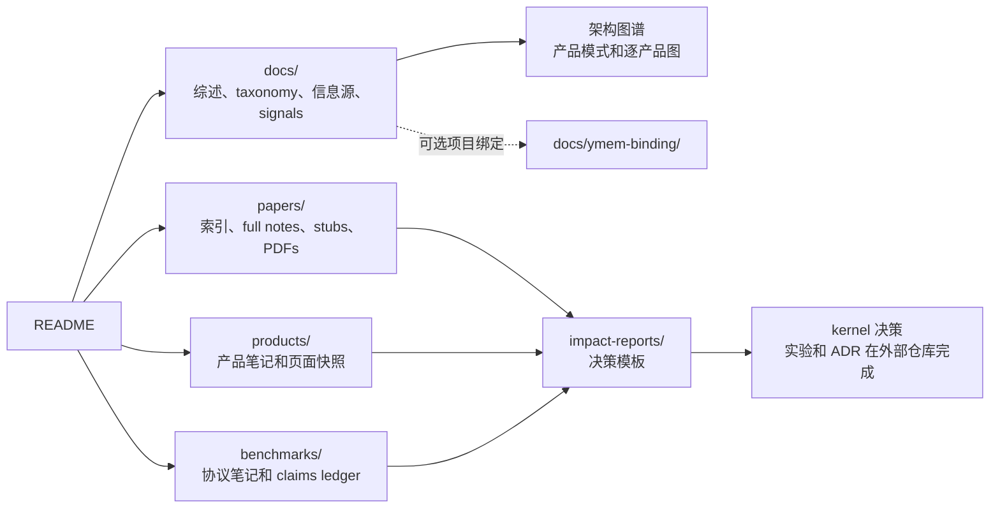

<div align="center">

# awesome-agent-memory

**面向 LLM agent 长程记忆的决策级证据库：抓取论文索引、当前来源 radar、产品笔记、benchmark 协议、架构图谱，以及从研究到 ADR 的工作流。**

**中文** · [English](README.md)

[](LICENSE)
[](papers/index.md)
[](papers/pdfs/)
[](products/)
[](benchmarks/)
[](docs/meta-surveys.md)
[](docs/signals.md)

</div>

---

## 目录

1. [这个仓库是什么](#这个仓库是什么)
2. [一眼总览](#一眼总览)
3. [怎么使用](#怎么使用)
4. [证据模型](#证据模型)
5. [仓库地图](#仓库地图)
6. [仓库结构](#仓库结构)
7. [范围边界](#范围边界)
8. [License 与存档策略](#license-与存档策略)
9. [发起方与维护](#发起方与维护)
10. [贡献](#贡献)

## 这个仓库是什么

`awesome-agent-memory` 不只是一个 awesome list。它是一个结构化证据库，用来
判断 LLM agent 的长程记忆应该如何设计、评估和运营。

仓库把证据拆成五层：

| 层级 | 负责什么 | 主入口 |
|---|---|---|
| 论文 | 学术主张、方法和本地阅读笔记 | [`papers/index.md`](papers/index.md) |
| 产品 | 记忆产品和内建 memory 平台的公开能力 | [`docs/products-landscape.md`](docs/products-landscape.md) |
| Benchmark | 评测协议、使用事件、厂商 claims 和方法批评 | [`docs/benchmarks-landscape.md`](docs/benchmarks-landscape.md) |
| 综合文档 | taxonomy、活综述、架构模式、信息源和信号日志 | [`docs/README.md`](docs/README.md) |
| 决策工作流 | 证据如何进入 ImpactReport、实验和 ADR 输入 | [`docs/research-radar.md`](docs/research-radar.md) |

核心维护原则是：直接证据、维护者推断、厂商自报、关联方评测和独立复现必须分开
记录，不能混成一个“排行榜”。

## 一眼总览

| 板块 | 当前覆盖 | 入口 | 适合用来 |
|---|---:|---|---|
| 论文索引 | 989 篇抓取论文 + 截至 2026-09 的手工 radar 新增 | [`papers/index.md`](papers/index.md) | 搜索 agent-memory 论文和发现线索；989 是 2026-05 抓取基线。 |
| 论文 stub | 988 个 stub | [`papers/stubs/`](papers/stubs/) | 跟踪已覆盖但尚未 full 阅读的论文。 |
| 本地 PDF | 534 个文件 | [`papers/pdfs/`](papers/pdfs/) | 复读来源和审计论文笔记。 |
| full / seed 论文笔记 | 7 个 full + 24 个 seed | [`papers/`](papers/) | 为架构决策引用人工阅读笔记。 |
| 记忆产品笔记 | 38 个笔记 | [`products/`](products/) | 对比 memory layer、memory SDK、managed memory 和带记忆的 agent 产品。 |
| 产品页面快照 | 37 个快照 | [`products/archives/`](products/archives/) | 在源页面变化后审计产品 claims。 |
| Benchmark 目录 | 24 个 catalog 行 | [`benchmarks/index.md`](benchmarks/index.md) | 理解 memory benchmark、stub-backed 候选行及其 claims 来源。 |
| Claims ledger | 结构化 YAML ledger | [`benchmarks/claims/claims.yaml`](benchmarks/claims/claims.yaml) | 区分厂商自报、论文评测、方法批评和独立复现。 |
| 成本节省专题 | seed landscape | [`docs/cost-savings-landscape.md`](docs/cost-savings-landscape.md) | 查找能减少 token、延迟或运行成本的 agent-memory 论文、方法、代码和产品。 |
| 综述与 taxonomy | 1 份活综述 + 6 条 meta-survey 记录 | [`docs/agent-memory-survey.md`](docs/agent-memory-survey.md) · [`docs/meta-surveys.md`](docs/meta-surveys.md) | 在选型或设计前建立领域视角。 |
| Impact reports | 目前只有模板 | [`impact-reports/README.md`](impact-reports/README.md) | 把强证据提升为 memory-kernel 架构建议。 |

## 怎么使用

按你的问题选择路径：

| 目标 | 先读这些 |
|---|---|
| 快速理解领域 | [`docs/agent-memory-survey.md`](docs/agent-memory-survey.md)，再读 [`docs/taxonomy.md`](docs/taxonomy.md) |
| 阅读最新来源刷新 | [`docs/memory-radar-2026-09-07.md`](docs/memory-radar-2026-09-07.md)，再看 [`docs/signals.md`](docs/signals.md) |
| 找相关论文 | [`papers/index.md`](papers/index.md)，再看 [`papers/`](papers/) 下的 full note |
| 比较记忆产品 | [`docs/products-landscape.md`](docs/products-landscape.md)、[`docs/product-memory-architectures.md`](docs/product-memory-architectures.md)、[`docs/product-architecture-diagrams.md`](docs/product-architecture-diagrams.md) |
| 查看产品为什么入库或被拒绝 | [`docs/product-discovery-log.md`](docs/product-discovery-log.md) |
| 探索 agent memory 如何节省成本 | [`docs/cost-savings-landscape.md`](docs/cost-savings-landscape.md)，再读 [`benchmarks/fact-based-memory-vs-long-context.md`](benchmarks/fact-based-memory-vs-long-context.md) 和 [`papers/mem0-paper.md`](papers/mem0-paper.md) |
| 评估 benchmark claims | [`docs/benchmarks-landscape.md`](docs/benchmarks-landscape.md)、[`benchmarks/index.md`](benchmarks/index.md)、[`benchmarks/claims/claims.yaml`](benchmarks/claims/claims.yaml) |
| 跟踪新发布和信息源 | [`docs/signals.md`](docs/signals.md)、[`docs/information-sources.md`](docs/information-sources.md) |
| 把研究转成 kernel 决策 | [`docs/research-radar.md`](docs/research-radar.md)，再用 [`impact-reports/README.md`](impact-reports/README.md) |
| 查看 Ymem 特定绑定 | [`docs/ymem-binding/README.md`](docs/ymem-binding/README.md) |

### 用 repo-local Skill 使用本仓

使用支持 repo-local skill 的 agent 工具时，也可以调用
`$awesome-agent-memory`，把本仓作为一个有证据支撑的评审工具使用。

前提：在能加载 `.codex/skills/*/SKILL.md` 的 agent 工具中打开本仓，或先把这个
skill 安装或启用到你的 agent 环境。如果 `$awesome-agent-memory` 不可用，就直接
使用 `.codex/skills/awesome-agent-memory/SKILL.md` 里的指令，并把当前 checkout
作为 `AAM_ROOT`。

适用场景：你想把自己的项目、代码库、算法、产品、创业方向或研究方向，与本仓的
论文、产品笔记、benchmark 记录和综合文档进行对比。

常见入口：

| 你在哪里 | 怎么说 |
|---|---|
| 在本仓 | 把当前 checkout 作为 `AAM_ROOT`，把 `/path/to/my-project` 作为 `TARGET_ROOT`。 |
| 在自己的项目仓库，且 skill 已安装或启用 | 把当前项目作为 `TARGET_ROOT`，并指定 `/path/to/awesome-agent-memory` 作为 `AAM_ROOT`；否则先从本仓启动，再把你的项目路径作为 `TARGET_ROOT`。 |

示例：

```text
使用 $awesome-agent-memory，把 /path/to/my-project 作为 TARGET_ROOT，
与当前 checkout 这个 AAM_ROOT 对比。
重点看架构适配、相似产品、benchmark 方案和不能随便宣称的风险点。
```

这个 skill 需要一个具体目标材料，例如路径、URL、README、设计文档、产品页面或
代码文件。它会区分 `TARGET_ROOT` 和 `AAM_ROOT`，然后输出适配图、可比参考、
差距与风险，以及带证据类别和置信度的建议。

## 证据模型

仓库按来源类型组织 claims，方便追溯：

| 证据类型 | 存放位置 | 读取方式 |
|---|---|---|
| 一手论文证据 | [`papers/`](papers/) 的 full note 和 [`papers/index.md`](papers/index.md) 的 canonical link | full note 可支持方法和 benchmark 协议判断。 |
| 论文 stub | [`papers/stubs/`](papers/stubs/) | 只代表发现覆盖；进入 ImpactReport 前必须升级。 |
| 产品公开能力 | [`products/`](products/) 的产品笔记和 [`products/archives/`](products/archives/) 的快照 | 支持“厂商宣称/提供 X”，不等于独立性能结论。 |
| 厂商 benchmark claims | [`benchmarks/claims/claims.yaml`](benchmarks/claims/claims.yaml) | 除非有独立复现，否则必须继续标注为 vendor 或 affiliated evidence。 |
| 独立复现 | [`benchmarks/claims/claims.yaml`](benchmarks/claims/claims.yaml) | 需要第三方实验设置足够清楚，才能和原始 claim 对比。 |
| 维护者综合判断 | [`docs/`](docs/) | 可用于优先级和设计判断，但不能当作直接证据。 |

## 仓库地图



## 仓库结构

### 概念与综合文档

| 路径 | 用途 |
|---|---|
| [`docs/README.md`](docs/README.md) | 文档地图和推荐阅读顺序。 |
| [`docs/agent-memory-survey.md`](docs/agent-memory-survey.md) | 记忆架构、检索、整合、遗忘和评估的活综述。 |
| [`docs/taxonomy.md`](docs/taxonomy.md) | 分类 agent-memory 系统和 memory-kernel 职责的共享词表。 |
| [`docs/meta-surveys.md`](docs/meta-surveys.md) | 2025 年末到 2026 H1 的外部 meta-survey 索引。 |
| [`docs/research-radar.md`](docs/research-radar.md) | 把论文、产品、benchmark 证据转成 ImpactReport 和 ADR 输入的工作流。 |
| [`docs/memory-radar-2026-09-07.md`](docs/memory-radar-2026-09-07.md) | 2026-09-07 周更来源刷新，覆盖论文、benchmark、产品、GitHub discovery 和 reviewer 分流结论。 |
| [`docs/cost-savings-landscape.md`](docs/cost-savings-landscape.md) | agent-memory token reduction、预算检索、运行成本方法、代码路径和产品实践信号专题。 |
| [`docs/information-sources.md`](docs/information-sources.md) | 论文、产品、社区和中文信息源 catalog。 |
| [`docs/related-work.md`](docs/related-work.md) | 发现线索归因和抓取来源记录。 |
| [`docs/signals.md`](docs/signals.md) | release、对比文章和博客信号的反时序日志。 |

### 产品与架构图谱

| 路径 | 用途 |
|---|---|
| [`products/`](products/) | 38 个记忆产品笔记，包括 Mem0、Letta、Zep、Graphiti、EverOS、MemOS、Redis Agent Memory Server、Supermemory、TencentDB Agent Memory、agentmemory、Memori、memU、memsearch 和平台 managed memory 等。 |
| [`products/archives/`](products/archives/) | 37 个记忆产品 canonical 页面 markdown 快照。 |
| [`docs/products-landscape.md`](docs/products-landscape.md) | 按领域和服务对象整理的产品全景。 |
| [`docs/product-discovery-log.md`](docs/product-discovery-log.md) | 多子 agent 产品搜索日志，记录 Tier A、Tier B、拒绝和 alias 决策。 |
| [`docs/product-memory-architectures.md`](docs/product-memory-architectures.md) | 跨产品架构模式：Memory OS、graph/temporal memory、MCP/local-first memory、云厂商 managed memory 和个人记忆。 |
| [`docs/product-architecture-diagrams.md`](docs/product-architecture-diagrams.md) | 基于公开产品模式的逐产品 Mermaid 架构图。 |

### 论文、Benchmark 与决策工作流

| 路径 | 用途 |
|---|---|
| [`papers/`](papers/) | 7 个 full 论文笔记、24 个 seed 笔记和主索引 [`index.md`](papers/index.md)。 |
| [`papers/stubs/`](papers/stubs/) | 988 个尚未 full 阅读论文的生成 stub。 |
| [`papers/pdfs/`](papers/pdfs/) | 534 个本地 PDF，约 1.8 GB。详见下方存档策略。 |
| [`papers/_scrape/`](papers/_scrape/) | 可复现产物：抓取脚本和 dedup JSON。 |
| [`benchmarks/`](benchmarks/) | 24 个 benchmark catalog 行，包含协议笔记、stub-backed 候选行和笔记模板。 |
| [`benchmarks/claims/`](benchmarks/claims/) | benchmark 提及、厂商自报、方法批评和复现的 usage-event ledger。 |
| [`benchmarks/archives/`](benchmarks/archives/) | benchmark 页面、repo 或 dataset card 的可选审计快照。 |
| [`docs/benchmarks-landscape.md`](docs/benchmarks-landscape.md) | 按能力、使用方式和证据独立性整理的 benchmark 全景。 |
| [`impact-reports/README.md`](impact-reports/README.md) | 把强证据提升为架构建议的模板。 |

### 治理与项目绑定

| 路径 | 用途 |
|---|---|
| [`CONTRIBUTING.md`](CONTRIBUTING.md) | 论文、产品、benchmark 和 evidence ledger 的贡献规则。 |
| [`CODE_OF_CONDUCT.md`](CODE_OF_CONDUCT.md) | 社区行为准则。 |
| [`SECURITY.md`](SECURITY.md) | 安全问题报告方式。 |
| [`CITATION.cff`](CITATION.cff) | 引用元数据。 |
| [`.codex/skills/awesome-agent-memory/`](.codex/skills/awesome-agent-memory/) | repo-local skill，用来把外部项目、代码、算法或产品与本仓证据库进行对比。 |
| [`docs/ymem-binding/`](docs/ymem-binding/) | 维护者的 [Ymem](https://github.com/Snseam/Ymem) kernel 项目绑定；如果只需要通用证据库，可以跳过。 |

## 范围边界

纳入范围：

- LLM agent 的长程、多会话记忆；
- 记忆写入、检索、整合、遗忘、个性化、溯源、治理和审计；
- 把 memory 作为一等能力公开暴露的产品；
- 用于评估记忆行为、个性化、时间推理、遗忘或 memory-layer 成本/质量权衡的 benchmark。

排除或仅作为相邻背景：

- 没有 memory lifecycle 的纯 vector DB；
- 不处理更新、整合或遗忘的普通 RAG 中间件；
- memory 不是一等接口的通用 agent 框架；
- 单独的 long-context inference 或 prompt cache；
- 被包装成独立证据的厂商性能 claims。

## License 与存档策略

笔记和综述内容以 [Apache 2.0](LICENSE) 协议发布。外部论文和文章的引用片段
仍归原作者所有，本仓仅用于研究评议和注释。

[`papers/pdfs/`](papers/pdfs/) 中的本地 PDF 来自允许 redistribute 的来源，
例如 arXiv、ACL Anthology 和开放 OpenReview 投稿。若发现某 PDF 的源协议禁止
redistribute，请开 issue，仓库会移除；对应笔记中的 canonical URL 仍是权威来源。

产品和 benchmark 页面快照是审计备份，不是商业材料的再发布。外部或商用引用应使用
快照 header 中的原始 URL。

## 发起方与维护

本仓由 [Ymem](https://github.com/Snseam/Ymem) 项目发起，但公开入口应当对任何
agent-memory kernel 都有用。Ymem 特定的模块名、维护者立场和内部 benchmark 选择
收纳在 [`docs/ymem-binding/`](docs/ymem-binding/)。

论文索引也使用若干公开 awesome-list 仓库作为发现入口。归因和抓取产物见
[`docs/related-work.md`](docs/related-work.md) 与 [`papers/_scrape/`](papers/_scrape/)。
这些来源只用于发现；笔记、综合判断和维护口径由本仓维护。

## 贡献

参见 [`CONTRIBUTING.md`](CONTRIBUTING.md) 和
[`CODE_OF_CONDUCT.md`](CODE_OF_CONDUCT.md)。简言之：

- 新论文：在 [`papers/`](papers/) 下新增或升级笔记；进入 ImpactReport 前需要 full note。
- 新产品：在 [`products/`](products/) 下新增笔记，必要时存档源页面；核心产品还要更新产品全景。
- 新 benchmark：新增或更新 benchmark note，并在
  [`benchmarks/claims/claims.yaml`](benchmarks/claims/claims.yaml) 记录使用事件。
- 新产品或 benchmark claim：标清来源是厂商自报、关联方评测、方法批评还是独立复现。
- 新信息源：更新 [`docs/information-sources.md`](docs/information-sources.md)
  或 [`docs/related-work.md`](docs/related-work.md)。

---

> 本仓内容由维护者撰写；部分 stub 和初稿使用 LLM 工具加速。full note 应基于实际
> PDF、产品页面、benchmark 来源或已归档快照，而不是未经验证的二手摘要。

<div align="center">

**[活综述](docs/agent-memory-survey.md)** ·
**[文档地图](docs/README.md)** ·
**[Papers 索引](papers/index.md)** ·
**[Benchmark](benchmarks/index.md)** ·
**[记忆产品全景](docs/products-landscape.md)** ·
**[产品架构图谱](docs/product-memory-architectures.md)** ·
**[信号日志](docs/signals.md)** ·
**[English](README.md)**

</div>
