# Memory 产品架构图

范围:本页的证据索引覆盖当前 `products/` 下的 39 个产品/模式笔记;逐产品
Mermaid 图当前覆盖 34 个产品/模式。2026-06-24 新增的 agentmemory、Memori、memU、
memsearch 与 2026-07-07 新增的 Tree Ring Memory 只进入证据索引和
pending-diagram 队列,尚无逐产品 Mermaid 图。图是基于
公开页面、GitHub README、论文摘要与本仓快照的**架构归纳**;闭源 SaaS 与厂商内建
记忆没有底层实现披露时,图只表达可观察产品边界和合理推断,不当作内部实现事实。

跨产品架构模式的总览与对比表见
[`product-memory-architectures.md`](product-memory-architectures.md);本页保留
逐产品/逐模式 Mermaid 图。

## 1. 总体分型

```mermaid
flowchart TB
    Products["Memory products"]
    Dedicated["独立 memory layer / SDK"]
    Runtime["Agent runtime 内嵌记忆"]
    Graph["Temporal / ontology graph memory"]
    Layered["分层认知 / OS-style memory"]
    Personal["个人可携带 memory vault"]
    Vendor["厂商内建 managed memory"]
    Wiki["Markdown / wiki 编译型记忆"]
    Coding["MCP / coding-agent memory"]
    DBMemory["DB / context database memory"]

    Products --> Dedicated
    Products --> Runtime
    Products --> Graph
    Products --> Layered
    Products --> Personal
    Products --> Vendor
    Products --> Wiki
    Products --> Coding
    Products --> DBMemory

    Dedicated --> Mem0["Mem0"]
    Dedicated --> Hindsight["Hindsight"]
    Dedicated --> Supermemory["Supermemory"]
    Dedicated --> RedisAMS["Redis Agent Memory Server"]
    Dedicated --> PowerMem["PowerMem"]
    Dedicated --> Honcho["Honcho"]
    Runtime --> LangMem["LangMem"]
    Runtime --> Letta["Letta"]
    Runtime --> MemGPT["MemGPT"]
    Graph --> Zep["Zep"]
    Graph --> Graphiti["Graphiti"]
    Graph --> Cognee["Cognee"]
    Graph --> OpenViking["OpenViking"]
    Layered --> TencentDB["TencentDB Agent Memory"]
    Layered --> HyMemory["Hy-Memory"]
    Layered --> MemoryOS["MemoryOS"]
    Layered --> EverOS["EverOS"]
    Layered --> MemOS["MemOS"]
    Layered --> AMEM["A-MEM"]
    Layered --> MemX["MemX"]
    Personal --> Anuma["Anuma"]
    Personal --> Kinic["Kinic"]
    Personal --> PersonalAI["Personal AI"]
    Vendor --> OpenAI["OpenAI ChatGPT Memory"]
    Vendor --> ClaudeDreams["Claude Dreams"]
    Vendor --> AWS["AWS AgentCore Memory"]
    Vendor --> Google["Google Memory Bank"]
    Vendor --> Microsoft["Microsoft Foundry Memory"]
    Vendor --> Cloudflare["Cloudflare Agent Memory"]
    Vendor --> Oracle["Oracle AI Agent Memory"]
    Vendor --> Alibaba["Alibaba Bailian Memory"]
    Wiki --> KarpathyWiki["Karpathy LLM Wiki"]
    Coding --> BasicMemory["Basic Memory"]
    Coding --> TreeRing["Tree Ring Memory"]
    Coding --> ByteRover["ByteRover"]
    DBMemory --> RedisAMS
    DBMemory --> Oracle
    DBMemory --> OpenViking
```

## 2. 独立 memory layer / SDK

### Mem0

核心是 conversation/message 输入经 LLM 抽取成 memory,按 `user/session/agent`
等 scope 写入向量/元数据/实体链接索引;查询时做多信号召回,再把 memory 注入
应用上下文。

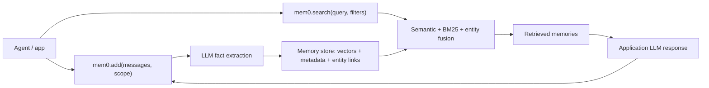

### Hindsight

Hindsight 把记忆放进 memory banks,写入路径分成 world facts 与 experiences;
`retain / recall / reflect` 是主要 API。检索并行使用语义、关键词、图关系和时间
过滤,再融合/重排。

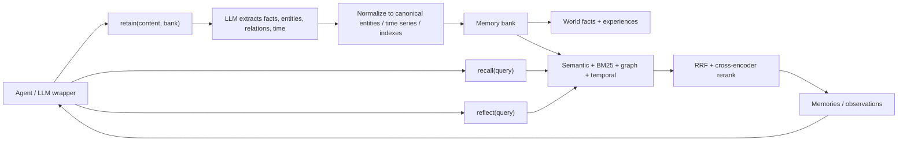

### Supermemory

Supermemory 更像 context cloud:connectors、extractors、profiles、RAG 和 memory
共享同一张可查询图;agent 通过 API/MCP/插件实时遍历图获得上下文。

```mermaid
flowchart LR
    Sources["Slack / Notion / Drive / Gmail / GitHub / files"]
    Connectors["Connectors + sync"]
    Extractors["Extractors: PDF / web / image / audio / files"]
    Understand["User understanding + entity model"]
    Graph["Unified queryable graph: memory + RAG + profiles"]
    Retrieve["SuperRAG / graph traversal"]
    Interfaces["API / SDK / MCP / plugins / filesystem"]
    Agent["Agent"]

    Sources --> Connectors --> Extractors --> Understand --> Graph
    Agent --> Interfaces --> Retrieve --> Graph
    Graph --> Retrieve --> Agent
```

## 3. Temporal / ontology graph memory

### Zep

Zep 是托管 agent memory / context engineering 层。输入可以是聊天、业务数据、
应用事件和文档;系统抽取 entity/fact,维护 temporal context graph,在事实变化时
保留旧事实的时间边界并让最新事实进入上下文。

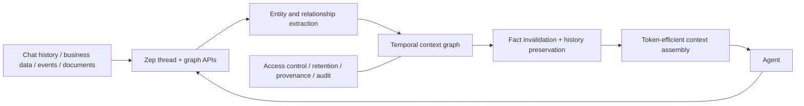

### Graphiti

Graphiti 是 Zep 的开源 temporal knowledge graph 底座。它把 episodes 转为 entities
与带有效时间窗的 facts,使用语义向量、BM25 和图遍历三路混合检索。

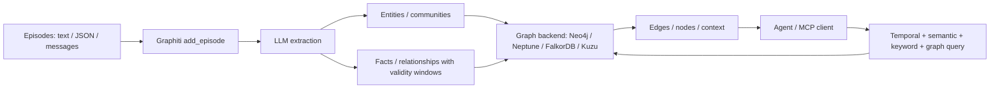

### Cognee

Cognee 的公开架构是 Capture -> Model -> Recall:接数据源,解析/嵌入/保留
provenance;再抽取实体、关系、ontology、权限和 feedback,形成跨 agent 的共享
memory layer。

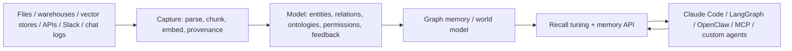

## 4. Agent runtime 内嵌记忆

### Letta

Letta 继承 MemGPT 的 stateful agent 思路:agent state 持有 memory blocks
(如 `human`、`persona`)与 tools;应用通过 API/SDK 创建 agent 并发送消息,记忆是
agent runtime 的一部分。

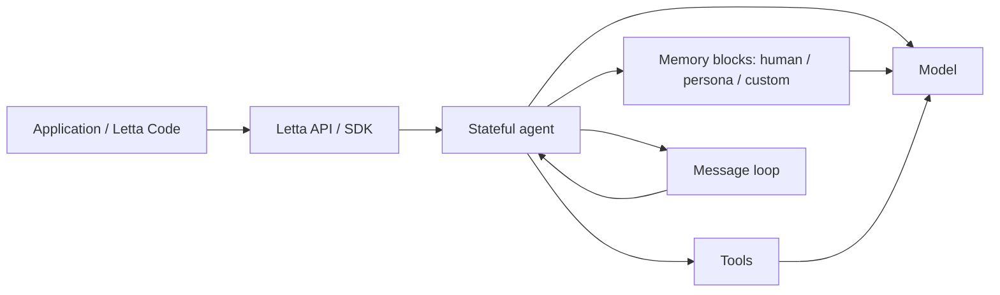

### LangMem

LangMem 是 LangGraph/LangChain 生态的 memory primitive:hot path 由 agent 工具
直接管理/搜索记忆;background path 自动抽取、整理和更新知识,底层 store 可替换。

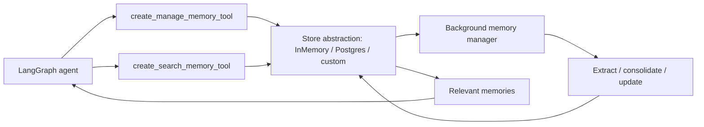

### MemGPT

MemGPT 是 OS-style virtual context management:把有限 context window 当主内存,
把外部存储当慢内存,模型通过 function calls 显式把信息分页进出上下文。

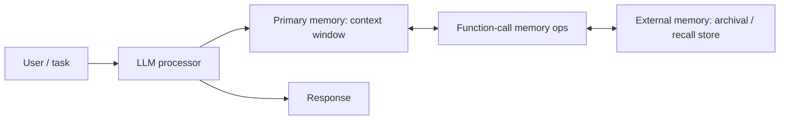

## 5. 分层认知 / OS-style memory

### TencentDB Agent Memory

TencentDB Agent Memory 有两条关键线:短期 context offloading 用 Mermaid canvas
保留任务结构并可回溯原始日志;长期 personalization 走 L0-L3 语义金字塔。

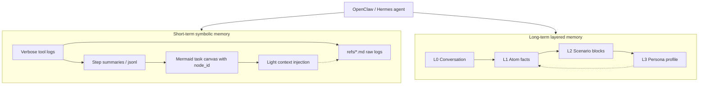

### Hy-Memory

Hy-Memory 是 OpenClaw 插件。OpenClaw pre-chat 同步召回,post-chat 异步捕获;Python
sidecar 用 Hunyuan/兼容模型抽取,Chroma/BGE-M3 做向量层,上层组织为 6-layer
cognitive memory。

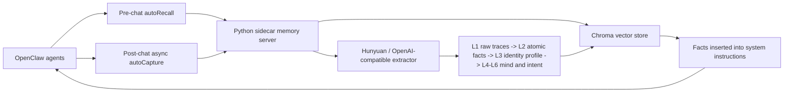

### MemoryOS

MemoryOS 用 short-term、mid-term、long-term 三层记忆,由 storage、updating、
retrieval、generation 模块编排;MCP server 暴露 add/retrieve/profile 三类工具。

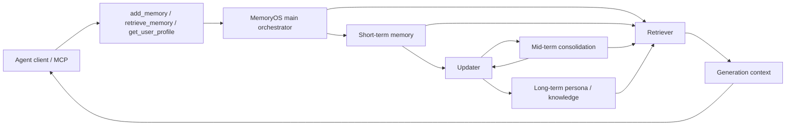

### A-MEM

A-MEM 把 memory 当 Zettelkasten 式 note network。新增/更新 note 时,系统通过
ChromaDB 找语义关系,更新 tags/context/keywords,并建立 note 间链接。

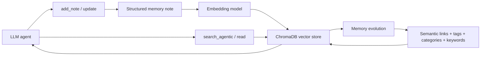

### MemX

MemX 是本地优先单文件 memory。查询走 embed -> dual recall -> RRF -> 四因子
rerank -> reject gate;低置信时直接返回空结果。

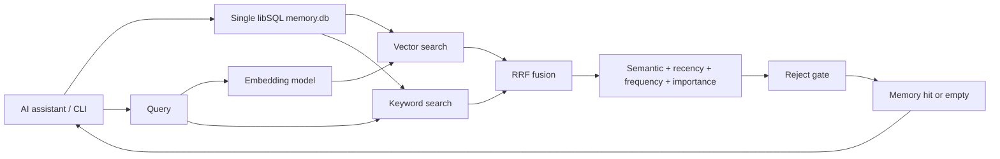

## 6. 个人可携带 memory vault

### Anuma

Anuma 的公开架构强调两层:设备端加密 private memory 与跨模型 interoperability。
服务器负责路由到模型,但产品声明不持有可读 plaintext memory。

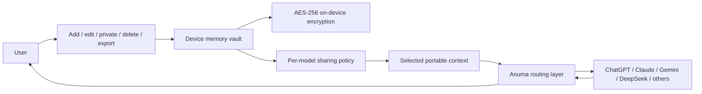

### Kinic

Kinic 把 personal AI memory 与 verifiable datastore 绑定:浏览器插件收集数据,
个人 vector DB 运行在 Internet Computer canister,由用户控制 key,支持更新/删除和
AI-powered query。

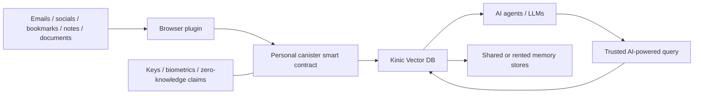

### Personal AI

Personal AI 的产品分三层:My AI 是终端 assistant,Persona Studio 是配置/部署
persona 的 builder,Memory Core 是 encode/stabilize/recall/evolve 的基础设施层。

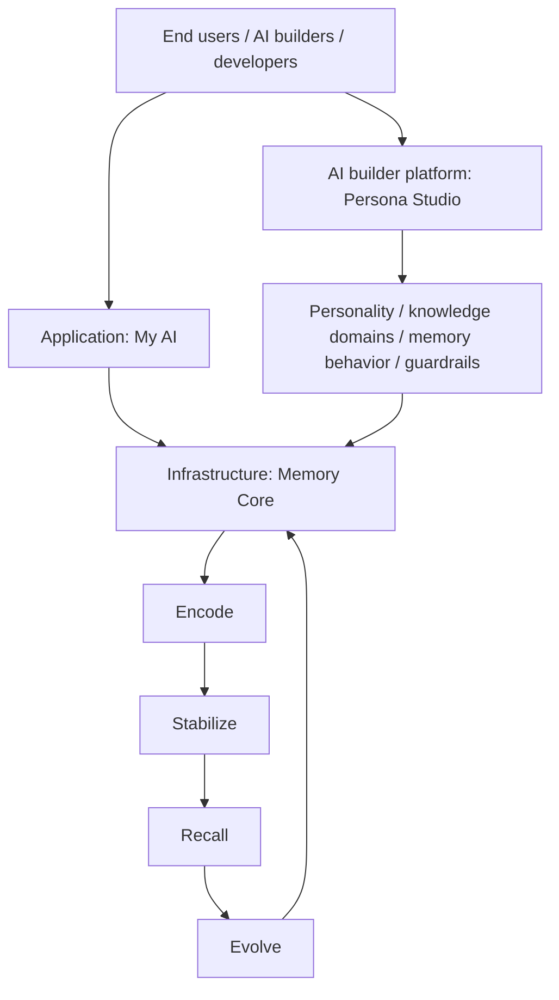

## 7. 厂商内建 managed memory

### OpenAI ChatGPT Memory

OpenAI 的 ChatGPT memory 是账号级 managed memory。公开说明显示它会从聊天、
文件、连接应用和 saved memories/past chats 中提取/综合相关上下文,用户通过
Memory controls、Memory summary 和 sources 管理。

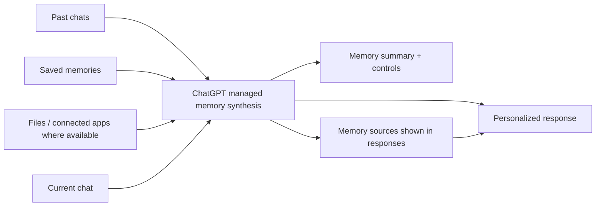

### Claude Dreams

Claude Dreams 是离线整理 job,不是在线检索层。它读取已有 memory store 和过去
sessions,输出一个新的 memory store;输入 store 不被就地修改,适合审阅后替换或丢弃。

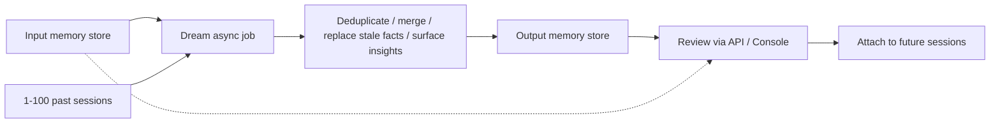

## 8. Markdown / wiki 编译型记忆

### Karpathy LLM Wiki

LLM Wiki 不是 SaaS 产品,而是一种 personal knowledge architecture:raw sources
只读,LLM 持续维护 wiki 这个中间表示,AGENTS/CLAUDE schema 约束维护协议,再通过
index/log/lint 保持健康。

```mermaid
flowchart LR
    Raw["Raw sources: immutable documents"]
    Schema["Schema: AGENTS.md / CLAUDE.md conventions"]
    Agent["LLM agent maintainer"]
    Wiki["Generated markdown wiki"]
    Index["index.md"]
    Log["log.md"]
    Lint["Periodic lint: contradictions / stale pages / orphans"]
    Query["Questions / outputs"]
    Human["Human reader in Obsidian / git"]

    Raw --> Agent
    Schema --> Agent
    Agent --> Wiki
    Wiki --> Index
    Wiki --> Log
    Wiki --> Lint --> Agent
    Human --> Query --> Agent --> Wiki
    Wiki --> Human
```

## 9. Memory OS / layered cognition 扩展

### EverOS

```mermaid
flowchart LR
    Inputs["Messages / images / docs / PDFs / URLs"]
    Add["EverOS add memory"]
    Tag["Auto-tag Profile / Episodic / Skill"]
    Case["Case traces"]
    Distill["Offline skill distillation"]
    Store["Markdown-exportable memory store"]
    Retrieve["mRAG retrieval"]
    Agents["Claude Code / Codex / OpenClaw / MCP agents"]

    Inputs --> Add --> Tag --> Store
    Agents --> Case --> Distill --> Store
    Agents --> Retrieve --> Store --> Agents
```

### MemOS

```mermaid
flowchart LR
    Agent["LLM / AI agent"]
    Events["Interactions / tasks / skills"]
    Extract["Memory extraction"]
    OS["MemOS memory resource manager"]
    Hybrid["Hybrid retrieval index"]
    Skill["Cross-task skill reuse"]
    Context["Retrieved memory context"]

    Agent --> Events --> Extract --> OS
    OS --> Hybrid --> Context --> Agent
    OS --> Skill --> Context
```

## 10. Platform-managed memory

### Cloudflare Agent Memory

```mermaid
flowchart LR
    Agent["Cloudflare Agent"]
    Session["Session API"]
    History["Conversation history tree"]
    Blocks["Context memory blocks"]
    SQLite["SQLite / provider-backed store"]
    Search["FTS / custom searchable provider"]
    Prompt["System prompt injection"]

    Agent --> Session
    Session --> History --> SQLite
    Session --> Blocks --> SQLite
    Blocks --> Search --> Prompt --> Agent
```

### AWS Bedrock AgentCore Memory

```mermaid
flowchart LR
    Agent["AgentCore agent"]
    Events["Session events"]
    Short["Short-term memory"]
    Strategy["Long-term memory strategy"]
    Extract["Extract insights / preferences / facts / summaries"]
    Store["Managed memory resource"]
    Recall["Cross-session recall"]

    Agent --> Events --> Short --> Store
    Events --> Strategy --> Extract --> Store
    Store --> Recall --> Agent
```

### Google Agent Platform Memory Bank

```mermaid
flowchart LR
    Conversation["User-agent conversation"]
    Scope["Scope: agent + user"]
    Extract["Async memory generation"]
    Bank["Managed Memory Bank"]
    Govern["TTL / revisions / IAM / poisoning controls"]
    Retrieve["Scoped retrieval"]
    Agent["Agent Platform app"]

    Conversation --> Scope --> Extract --> Bank
    Govern --- Bank
    Bank --> Retrieve --> Agent
```

### Microsoft Foundry Agent Service Memory

```mermaid
flowchart LR
    Agent["Foundry agent"]
    Tools["remember / forget / memory tools"]
    Scope["Request scope"]
    Items["Memory items"]
    TTL["Default TTL / lifecycle"]
    Types["Profile / summaries / procedural memory"]
    Context["Retrieved context"]

    Agent --> Tools --> Scope --> Items
    Items --> TTL
    Items --> Types --> Context --> Agent
```

### Oracle AI Agent Memory

```mermaid
flowchart LR
    Agent["Enterprise agent"]
    Short["Thread context cards / summaries"]
    Long["add / search workflows"]
    DB["Oracle AI Database"]
    Providers["LLM / embedding providers"]
    MCP["MCP server / external frameworks"]
    Governance["Auth, scoping, database governance"]

    Agent --> Short --> DB
    Agent --> Long --> DB
    Providers --> Long
    DB --> MCP --> Agent
    Governance --- DB
```

### Alibaba Bailian Memory Library

```mermaid
flowchart LR
    App["Agent app"]
    Dialogue["Historical dialogue"]
    Add["AddMemory"]
    Extract["Fragments + user profile extraction"]
    Library["Bailian memory library / memoryId"]
    Search["SearchMemory"]
    Prompt["Prompt injection by app"]

    App --> Dialogue --> Add --> Extract --> Library
    App --> Search --> Library --> Prompt --> App
```

## 11. MCP / local-first / coding-agent memory

### Redis Agent Memory Server

```mermaid
flowchart LR
    Agent["Agent / app / MCP client"]
    API["REST API / MCP / SDK"]
    Working["Working memory"]
    Long["Long-term memory"]
    Extract["Extraction / grounding / dedup / edit"]
    Search["Semantic + keyword + hybrid search"]
    Redis["Redis-backed store"]

    Agent --> API
    API --> Working --> Redis
    API --> Extract --> Long --> Redis
    Redis --> Search --> API --> Agent
```

### OpenViking

```mermaid
flowchart LR
    Sources["Memory / resources / skills"]
    FS["viking:// filesystem"]
    Layers["L0 abstracts / L1 overviews / L2 full details"]
    Session["Session commit"]
    Six["Profile, preferences, entities, events, cases, patterns"]
    Retrieve["Directory recursive retrieval"]
    Agent["OpenClaw / OpenCode / MCP agent"]

    Sources --> FS --> Layers
    Agent --> Session --> Six --> FS
    Agent --> Retrieve --> FS --> Agent
```

### PowerMem

```mermaid
flowchart LR
    Clients["CLI / HTTP / MCP / IDE plugins"]
    Memory["PowerMem Memory API"]
    Extract["LLM extraction + auto-merge"]
    Exp["Experience layer"]
    Skill["Skill distillation"]
    Hybrid["Vector + full-text + graph retrieval"]
    Store["OceanBase / seekdb / SQLite / Postgres"]

    Clients --> Memory --> Extract --> Exp --> Skill --> Store
    Store --> Hybrid --> Memory --> Clients
```

### Basic Memory

```mermaid
flowchart LR
    Human["Human editor"]
    Agent["AI assistant / MCP client"]
    Markdown["Plain Markdown files"]
    Graph["Semantic knowledge graph"]
    Search["Meaning search + wikilinks"]
    Cloud["Optional cloud sync / backups"]

    Human --> Markdown
    Agent --> Markdown
    Markdown --> Graph --> Search --> Agent
    Markdown --> Cloud
```

### ByteRover

```mermaid
flowchart LR
    Agents["Claude Code / Codex / Cursor / other coding agents"]
    CLI["brv CLI / MCP"]
    Events["Project decisions / code activity / tasks"]
    Tree["Project context tree"]
    Index["Recall index"]
    Context["Portable coding-agent context"]

    Agents --> CLI --> Events --> Tree --> Index --> Context --> Agents
```

### Honcho

```mermaid
flowchart LR
    App["Agent app"]
    Session["Sessions / messages / documents"]
    Peers["Peers: users, agents, groups, projects"]
    Reason["Background reasoning"]
    Rep["Peer representations / conclusions"]
    Search["Hybrid search / session context"]
    Inject["Prompt-ready context"]

    App --> Session --> Peers
    Session --> Reason --> Rep
    Session --> Search
    Rep --> Inject --> App
    Search --> Inject
```

## 12. 证据索引

| 产品 | 本仓笔记 | 上游主源 |
|---|---|---|
| Mem0 | [`../products/mem0.md`](../products/mem0.md) | <https://github.com/mem0ai/mem0> |
| Zep | [`../products/zep.md`](../products/zep.md) | <https://www.getzep.com> |
| Graphiti | [`../products/graphiti.md`](../products/graphiti.md) | <https://github.com/getzep/graphiti> |
| Cognee | [`../products/cognee.md`](../products/cognee.md) | <https://www.cognee.ai/> |
| Letta | [`../products/letta.md`](../products/letta.md) | <https://github.com/letta-ai/letta> |
| LangMem | [`../products/langmem.md`](../products/langmem.md) | <https://langchain-ai.github.io/langmem/> |
| Supermemory | [`../products/supermemory.md`](../products/supermemory.md) | <https://supermemory.ai/> |
| Hindsight | [`../products/hindsight.md`](../products/hindsight.md) | <https://github.com/vectorize-io/hindsight> |
| TencentDB Agent Memory | [`../products/tencentdb-agent-memory.md`](../products/tencentdb-agent-memory.md) | <https://github.com/TencentCloud/TencentDB-Agent-Memory> |
| EverOS | [`../products/everos.md`](../products/everos.md) | <https://evermind.ai/everos> |
| MemOS | [`../products/memos.md`](../products/memos.md) | <https://github.com/MemTensor/MemOS> |
| Redis Agent Memory Server | [`../products/redis-agent-memory-server.md`](../products/redis-agent-memory-server.md) | <https://redis.github.io/agent-memory-server/> |
| PowerMem | [`../products/powermem.md`](../products/powermem.md) | <https://github.com/oceanbase/powermem> |
| Basic Memory | [`../products/basic-memory.md`](../products/basic-memory.md) | <https://docs.basicmemory.com/> |
| ByteRover | [`../products/byterover.md`](../products/byterover.md) | <https://www.byterover.dev/> |
| Honcho | [`../products/honcho.md`](../products/honcho.md) | <https://github.com/plastic-labs/honcho> |
| agentmemory (pending diagram) | [`../products/agentmemory.md`](../products/agentmemory.md) | <https://github.com/rohitg00/agentmemory> |
| Memori (pending diagram) | [`../products/memori.md`](../products/memori.md) | <https://github.com/MemoriLabs/Memori> |
| memU (pending diagram) | [`../products/memu.md`](../products/memu.md) | <https://github.com/NevaMind-AI/memU> |
| memsearch (pending diagram) | [`../products/memsearch.md`](../products/memsearch.md) | <https://github.com/zilliztech/memsearch> |
| OpenViking | [`../products/openviking.md`](../products/openviking.md) | <https://volcengine-openviking.mintlify.app/> |
| Hy-Memory | [`../products/hy-memory.md`](../products/hy-memory.md) | <https://hy-memory.com/> |
| MemoryOS | [`../products/memoryos.md`](../products/memoryos.md) | <https://github.com/BAI-LAB/MemoryOS> |
| A-MEM | [`../products/a-mem.md`](../products/a-mem.md) | <https://github.com/agiresearch/A-mem> |
| MemX | [`../products/memx.md`](../products/memx.md) | <https://memx.me/> |
| Anuma | [`../products/anuma.md`](../products/anuma.md) | <https://www.anuma.ai/ai-memory> |
| Kinic | [`../products/kinic.md`](../products/kinic.md) | <https://www.kinic.io/> |
| Personal AI | [`../products/personal-ai.md`](../products/personal-ai.md) | <https://www.personal.ai/products> |
| OpenAI Memory | [`../products/openai-memory.md`](../products/openai-memory.md) | <https://help.openai.com/en/articles/8590148> |
| Claude Dreams | [`../products/claude-dreams.md`](../products/claude-dreams.md) | <https://platform.claude.com/docs/en/managed-agents/dreams> |
| Cloudflare Agent Memory | [`../products/cloudflare-agent-memory.md`](../products/cloudflare-agent-memory.md) | <https://blog.cloudflare.com/introducing-agent-memory/> |
| AWS AgentCore Memory | [`../products/aws-agentcore-memory.md`](../products/aws-agentcore-memory.md) | <https://docs.aws.amazon.com/bedrock-agentcore/latest/devguide/memory.html> |
| Google Memory Bank | [`../products/google-memory-bank.md`](../products/google-memory-bank.md) | <https://docs.cloud.google.com/gemini-enterprise-agent-platform/scale/memory-bank> |
| Microsoft Foundry Memory | [`../products/microsoft-foundry-memory.md`](../products/microsoft-foundry-memory.md) | <https://learn.microsoft.com/en-us/azure/foundry/agents/concepts/what-is-memory> |
| Oracle AI Agent Memory | [`../products/oracle-ai-agent-memory.md`](../products/oracle-ai-agent-memory.md) | <https://docs.oracle.com/en/database/oracle/agent-memory/26.4/agmea/about.html> |
| Alibaba Bailian Memory | [`../products/alibaba-bailian-memory.md`](../products/alibaba-bailian-memory.md) | <https://help.aliyun.com/zh/model-studio/memory-library> |
| MemGPT | [`../products/memgpt.md`](../products/memgpt.md) | <https://arxiv.org/abs/2310.08560> |
| Karpathy LLM Wiki | [`../products/karpathy-llm-wiki.md`](../products/karpathy-llm-wiki.md) | <https://gist.github.com/karpathy/442a6bf555914893e9891c11519de94f> |
