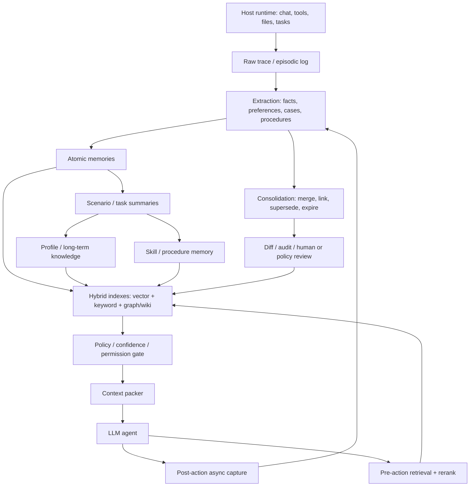
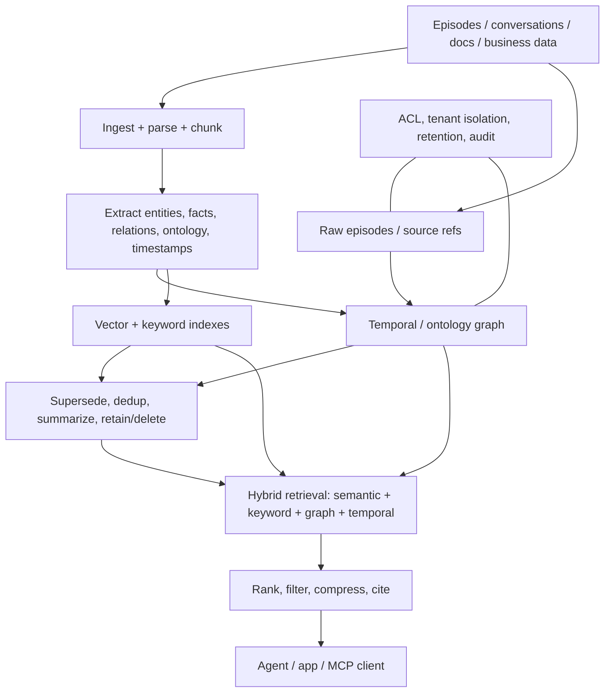
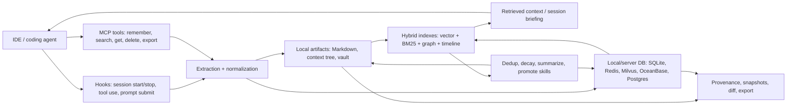
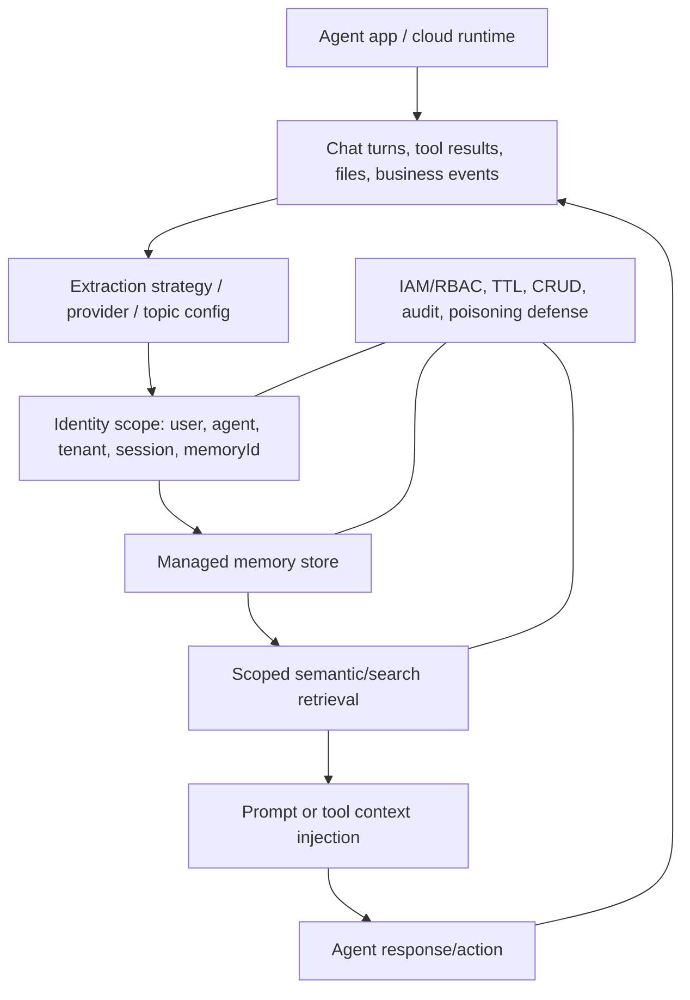
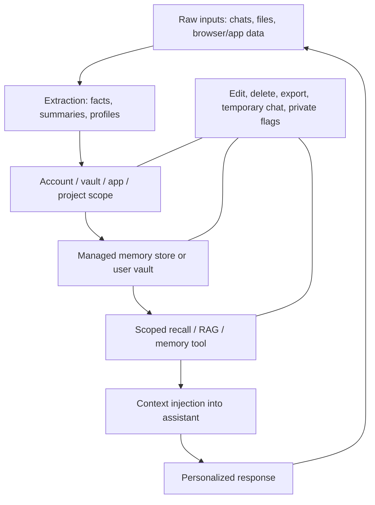

# 产品整体 memory 架构

这份文档不是逐产品介绍,而是把当前 `products/` 里的 memory 产品抽象成可比较的
架构模式。详细单品图见 [`product-architecture-diagrams.md`](product-architecture-diagrams.md),
入库证据见 [`product-discovery-log.md`](product-discovery-log.md)。

## 1. 总览图

```mermaid
flowchart TB
    Products["Agent memory products"]
    OS["Memory OS / layered cognition"]
    Graph["Graph / temporal / ontology"]
    MCP["MCP / local-first / coding-agent memory"]
    Managed["Platform-managed memory"]
    Personal["Personal / portable memory"]
    Adjacent["Adjacent embedded memory"]

    Products --> OS
    Products --> Graph
    Products --> MCP
    Products --> Managed
    Products --> Personal
    Products --> Adjacent

    OS --> EverOS["EverOS"]
    OS --> MemOS["MemOS"]
    OS --> MemoryOS["MemoryOS"]
    OS --> TencentDB["TencentDB Agent Memory"]
    OS --> HyMemory["Hy-Memory"]
    Graph --> Zep["Zep"]
    Graph --> Graphiti["Graphiti"]
    Graph --> Cognee["Cognee"]
    Graph --> OpenViking["OpenViking"]
    MCP --> BasicMemory["Basic Memory"]
    MCP --> TreeRing["Tree Ring Memory"]
    MCP --> ByteRover["ByteRover"]
    MCP --> RedisAMS["Redis AMS"]
    MCP --> PowerMem["PowerMem"]
    MCP --> Honcho["Honcho"]
    Managed --> AWS["AWS AgentCore Memory"]
    Managed --> Google["Google Memory Bank"]
    Managed --> Microsoft["Microsoft Foundry Memory"]
    Managed --> Cloudflare["Cloudflare Agent Memory"]
    Managed --> Oracle["Oracle AI Agent Memory"]
    Managed --> Alibaba["Alibaba Bailian Memory"]
    Personal --> OpenAI["OpenAI Memory"]
    Personal --> Claude["Claude Dreams / memory"]
    Personal --> PersonalAI["Personal AI"]
    Personal --> Anuma["Anuma"]
    Personal --> Kinic["Kinic"]
```

## 2. Memory OS / layered cognition

| Field | Synthesis |
|---|---|
| architecture pattern | 把 memory 当作操作系统/认知层资源管理:raw trace -> atomic memories -> scenario/task summaries -> profile/skill/procedure |
| products mapped | EverOS、MemOS、MemoryOS、TencentDB Agent Memory、Hy-Memory、A-MEM、MemX |
| common data flow | host runtime 捕获消息/工具/文件 -> 抽取 facts/cases -> 分层整合 -> hybrid index -> pre-action retrieval -> context pack |
| memory types | working memory、episodic、semantic、profile、procedural/skill、task canvas |
| retrieval/consolidation strategy | 多信号召回 + 离线 consolidation;重复成功轨迹提升为 skill/procedure;低价值或过期记忆合并/降权 |
| governance/inspectability | Markdown export、Mermaid canvas、分层 artifact 是强 inspectability 信号;云端/自动蒸馏仍需要 diff/audit |
| confidence/unknowns | 高置信于模式;中置信于各家内部 schema。EverOS/PowerMem benchmark 均为 vendor-claimed。 |

## 3. Graph / temporal / ontology memory

| Field | Synthesis |
|---|---|
| architecture pattern | 把对话、事件、文档转成 entities/facts/relations,并保留时间、来源和 ontology 类型 |
| products mapped | Zep、Graphiti、Cognee、OpenViking、HippoRAG-like systems、Oracle AI Agent Memory |
| common data flow | episodes/docs -> parse/chunk -> entity/relation extraction -> temporal/ontology graph + vector/keyword index -> hybrid retrieval |
| memory types | entity facts、relationship edges、valid-time facts、source episodes、ontology nodes、summary/context cards |
| retrieval/consolidation strategy | semantic + BM25 + graph traversal + temporal filters;新事实 supersede 旧事实而非直接覆盖 |
| governance/inspectability | provenance、valid time、audit logs、graph explainability 是关键;闭源托管图需要额外审计接口 |
| confidence/unknowns | Zep/Graphiti/Cognee/OpenViking 公开材料充分;Oracle 以官方 docs 为主,底层实现细节有限。 |

## 4. MCP / local-first / coding-agent memory

| Field | Synthesis |
|---|---|
| architecture pattern | sidecar memory substrate: IDE/agent hooks capture work, MCP exposes recall/write/delete/export tools, local files or DB store state |
| products mapped | Basic Memory、Tree Ring Memory、ByteRover、Redis Agent Memory Server、PowerMem、Honcho、Supermemory MCP、Pieces LTM、ClawMem、agentmemory、memsearch、memU、Memori |
| common data flow | IDE/session hooks -> extraction -> Markdown/context tree/local DB -> hybrid index -> MCP recall -> session briefing/context injection |
| memory types | project decisions、file history、debug episodes、preferences、skills、timeline、audit trail |
| retrieval/consolidation strategy | vector + BM25 + graph/timeline;session stop 或 compaction 前做总结,重复模式提升为 skills |
| governance/inspectability | 最强模式是 artifact-first:Markdown/context tree/git diff。DB-first 需要 export/audit/delete trail。 |
| confidence/unknowns | Basic Memory/Redis/PowerMem/Honcho 证据强;Tree Ring Memory 证据来自官方 repo/press kit,但仍是 protocol-preview;小型 MCP servers 需要补 license/release/source health。 |

## 5. Platform-managed memory

| Field | Synthesis |
|---|---|
| architecture pattern | 云平台提供 managed memory store + identity scope + retrieval tools;开发者配置 scope、TTL、strategy、权限 |
| products mapped | AWS AgentCore Memory、Google Memory Bank、Microsoft Foundry Memory、Cloudflare Agent Memory、Oracle AI Agent Memory、Alibaba Bailian Memory |
| common data flow | app/agent events -> managed extraction -> scoped store -> semantic/search retrieval -> prompt/tool injection -> cloud governance |
| memory types | session events、user profile、facts、chat summaries、procedural memory、thread context cards |
| retrieval/consolidation strategy | 平台内置抽取/合并/过期;部分平台暴露 strategy、TTL、CRUD 或 provider abstraction |
| governance/inspectability | IAM/RBAC、tenant isolation、TTL、CRUD、export、audit 是核心;内部提取/排序通常黑箱 |
| confidence/unknowns | 官方 docs 证据强;Cloudflare private beta、Google Preview/Pre-GA、Microsoft preview 需要时间标签。 |

## 6. Personal / portable memory

| Field | Synthesis |
|---|---|
| architecture pattern | 账号级或用户拥有的 memory vault,从日常聊天/文件/浏览器/应用数据抽取可跨模型使用的个人上下文 |
| products mapped | OpenAI Memory、Claude memory/Dreams、Gemini personal context、Personal AI、Anuma、Kinic |
| common data flow | personal interactions -> extraction -> account/vault store -> scoped recall -> personalized response |
| memory types | saved facts、chat-history memory、preferences、persona、private entries、portable vault memories |
| retrieval/consolidation strategy | consumer assistants 多为黑箱排序;portable memory 产品强调 edit/delete/export/private flags |
| governance/inspectability | 消费者需要 memory on/off、per-memory delete、temporary/incognito chat、export/wipe;企业需要 admin disable |
| confidence/unknowns | 用户控制面证据较强;内部 schema、冲突解决、保留策略通常不公开。 |

## 7. 对比表

| Pattern | Best signal | Weakness | Best Ymem design pressure |
|---|---|---|---|
| Memory OS / layered cognition | 明确处理 episodic/semantic/profile/skill lifecycle | 自动抽取和 skill distillation 容易黑箱 | `dream-consolidator` + diff review |
| Graph / temporal / ontology | provenance、valid time、关系可解释 | graph schema 和 ontology 成本高 | `ProvenanceRef` + temporal conflict policy |
| MCP / local-first / coding-agent | host integration 强,人类可审计 artifact 可行 | 小项目证据噪声大,协议安全边界复杂 | host-agnostic tools + audit/export/delete |
| Platform-managed memory | IAM/ops/scale 强,企业可直接采购 | 云黑箱、preview 状态、lock-in | scope/TTL/policy 最低治理基线 |
| Personal / portable memory | 贴近真实用户长期使用 | safety/consent/ownership 风险高 | mnemonic sovereignty + user controls |

## 8. 总结

当前产品集合说明一个明显趋势:agent memory 正从 "SDK + vector store" 扩展成五类
基础设施路线。最重要的分水岭不是用不用向量库,而是产品是否公开处理**写入、整合、
召回、遗忘、治理、审计**这六个生命周期问题。只有把这些问题作为一等能力的产品,
才进入核心产品层;其他 memory-adjacent 产品保持轻量索引。
